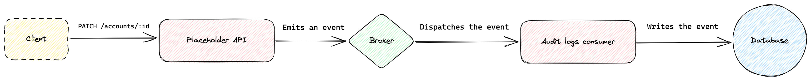

## Introduction

This test aims to demonstrate your ability to develop a service from scratch in Go (or any language of your choice), using both synchronous and asynchronous communication. We expect your code to be:
* Simple and concise
* Intelligent
* Well-documented

Additionally, any technical choices should be described. To complete this exercise, you should be familiar with SQL, asynchronous communication patterns such as consumer queues and sequencing, and replication.

As general advice, avoid writing complex code. Keep things as simple as possible and try to stick to the basics.

## Assignment

As your system expands, you need to integrate [audit logs](https://www.dnsstuff.com/what-is-audit-log) to track who is accessing or modifying resources at any given time. To achieve this, you'll build a placeholder API that emits an event to a message broker, which will then be consumed by an audit logs worker and eventually stored in a database. Below is an architecture diagram illustrating the communication flows:



## Diagram

Note that we will not focus on tracking the mutations themselves, such as storing the previous and current state of mutated resources. Let’s keep things simple.

## Walkthrough

### Useful commands

A docker-compose file has already been provided. For simplicity, there are no network definitions so you can call the services on localhost. You may choose to use it or not. If you prefer to use a different message broker than NATS, feel free to do so. However, we expect you to add another docker-compose file to your repository. Only PostgreSQL is a requirement.

### Structure your workspace

Begin by setting up a proper structure for your workspace. We expect files to be organized coherently and to be easy to locate. Both the placeholder API and the audit logs consumer should be two independent processes.

### Placeholder API

Write the placeholder API. You can name it whatever you like and use any libraries or none at all. In the diagram, we assumed that the original call made by the client was a mutation intent on an account with ID id. You can change this as it's only an example. This API should consist of:
* A router
* A single route that matches a given pattern
* A producer to emit to the message broker

At this stage, you should have in mind the data model of your audit logs to correctly answer the following questions:
* Who?
* What?
* When?

### Audit logs consumer

Write the code for the consumer. It should listen to a specific topic/channel and store the audit logs in the database. Your consumer should be:
* Horizontally scalable
* Fault-tolerant
* Self-healing

We expect you to develop a data model for storing the audit logs and write the SQL migrations accordingly. Migrations could be run independently from your service, or at its startup.

### Containerize your applications

Write the Dockerfiles to containerize both your systems.

### Running the system

To run the services you have to execute this command : 

```shell
  make docker-up
```

## Bonus points (3 max.)

* Integrate build/run steps inside the docker-compose.yaml file or a dedicated one.
* Write integration tests for your repository layer.
* Expose metrics for your different services.
* [Only if it was all too easy for you and you have plenty of time] Use the [Jaeger](https://www.jaegertracing.io/) deployment to trace your code end-to-end using [OpenTelemetry](https://opentelemetry.io/).

## Requirements

You should create a copy this repository before starting your work. Do not fork it.

Your code should be, at least partially, unit tested. We do not expect every single line of code to be tested but would like to evaluate your knowledge in testing.

Happy coding 🍀