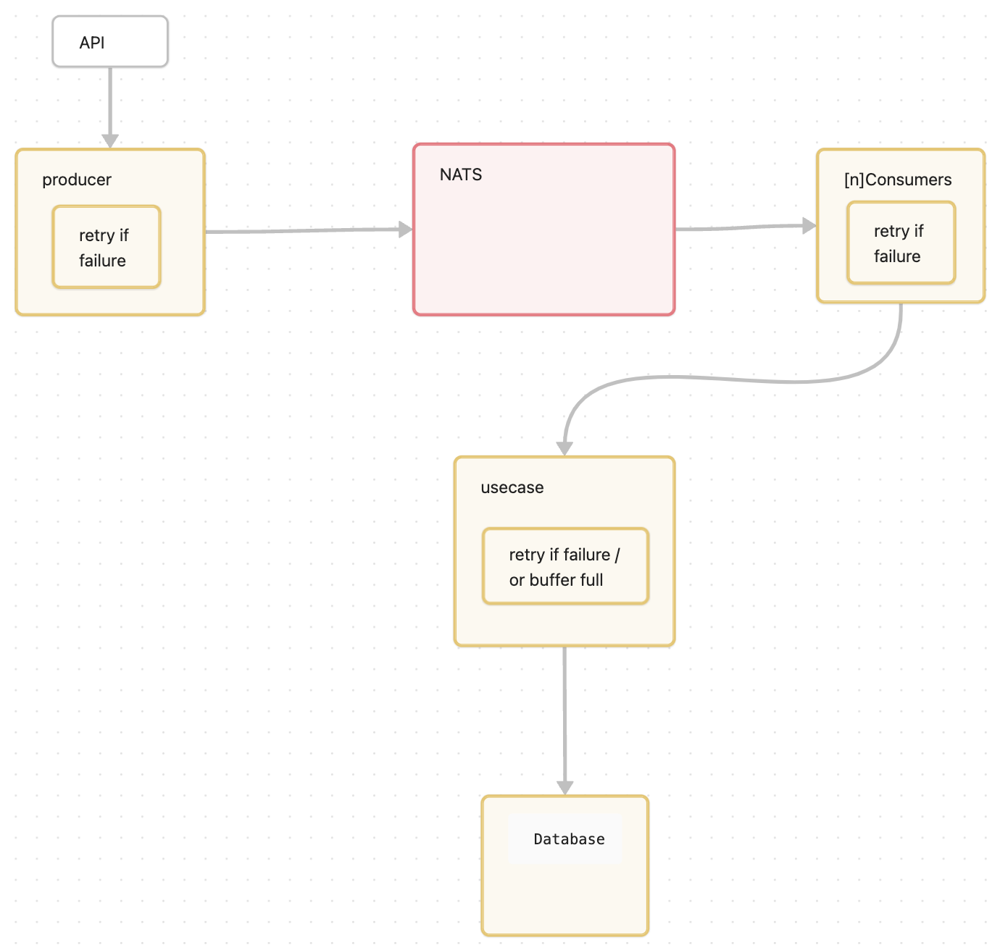

# Documentation

## Diagram



## Project Architecture

The project architecture is divided into several key components:

### 1. **Account Service**
   - **Directory**: `internal/account`
   - **Description**: Handles account-related operations and emits audit events.
   - **Dockerfile**: `internal/account/Dockerfile`
   - **Main Entry Point**: `internal/account/cmd/main.go`

### 2. **Audit Log Service**
   - **Directory**: `internal/auditlog`
   - **Description**: Consumes audit events from NATS and stores them in PostgreSQL.
   - **Dockerfile**: `internal/auditlog/Dockerfile`
   - **Main Entry Point**: `internal/auditlog/cmd/main.go`

### 3. **Message Broker (NATS)**
   - **Description**: Facilitates asynchronous communication between the account service and the audit log service.
   - **Docker Image**: `nats:2.10.26`

### 4. **Database (PostgreSQL)**
   - **Description**: Stores the audit logs.
   - **Docker Image**: `postgres:17`
   - **Migrations**: `migrations/01_create_audit_logs_table.sql`

### 5. **Docker Compose**
   - **File**: `docker-compose.yaml`
   - **Description**: Defines the services and their dependencies, allowing for easy setup and orchestration of the entire system.

---

## Solution

The service is designed to be **resilient**, meaning that if external components disconnect, the service can wait for them to recover and resume message pushing or consumption.

The external services that may cause issues are **NATS** and **PostgreSQL**, and both have been handled accordingly.  
Both services are **stateless**, meaning they can be horizontally scaled.

### **Audit Logs Service**
The audit log service contains a **consumer** that listens for messages from NATS and pushes them to the **use case**, which then records them in the database.  
If any step fails, a **retry mechanism** is in place.  
Retries are handled in the following cases:
- The database is down.
- NATS is down.
- The service buffer is full.

The service was built using **Go** as it is fully capable of handling this functionality efficiently.  
For a production solution, using **NATS with JetStream** could be a good alternative.

---

## Running the System

To start the services, run the following commands:

### **With Docker**

```sh
make docker-up

without docker : 

```shell
    make account
    make auditlog
    
```

## Usefull command 

### docker stats 

```shell
make docker-stats
```

### monitor nats informations
Install nats top 
```shell
  go install github.com/nats-io/nats-top@latest
```
Run it :
```shell
nats-top
```

## Running the tests

You have to up the database before.

Export environment variables:

```shell
  export $(grep -v '^#' .env.example | xargs)
```

Run the tests:
```shell
  make test-race
```


## Bonus points

The completed bonus points are:
	•	Integrated build/run steps inside the docker-compose.yaml file.
	•	Written integration tests for the repository layer.

I have decided to submit the project now to avoid delays. I have done my best to ensure quality and meet the requirements while balancing the challenges of my full-time job and personal life.

## Remerciements

Thank you very much! I really enjoyed doing this test.

Rami
